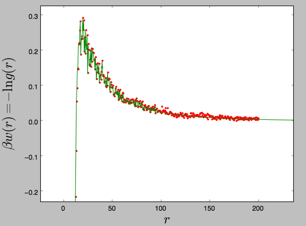

# virial.py
Script to fit the tail of radial distribution functions to arbitrary model potentials and to calculate
the resulting virial coefficient and/or Kirkwood-Buff integrals (todo).

## Usage

All options can be viewed from the command line by typing `virial.py -h`:

~~~~
usage: virial.py [-h] [-z z1 z2] [-a a1 a2] [-mw mw1 mw2] [-lB lB] [-D D]
                 [-m {dh,zero}] [-p] [-so] [--norm {none,cylinder,sphere}]
                 [-r min max] [--fitradii] [--no-fitdebye]
                 infile outfile

Fit tail of RDFs to model pair potentials

positional arguments:
  infile                two column input file with radial distribution function, g(r)
  outfile               three column output with manipulated r, w(r), g(r)

optional arguments:
  -h, --help            show this help message and exit
  -z z1 z2              valencies (default: [0, 0])
  -a a1 a2, --radii a1 a2
                        radii [angstrom] (default: [0, 0])
  -mw mw1 mw2           mol. weights [g/mol] (default: [0, 0])
  -lB lB, --bjerrum lB  Bjerrum length [angstrom] (default: 7.1)
  -D D, --debye D       Debye length [angstrom] (default: 1e+20)
  -m {dh,zero}, --model {dh,zero}
                        Model to fit (default: dh)
  -p, --plot            plot fitted w(r) using matplotlib (default: False)
  -so, --shiftonly      do not replace tail w. model potential (default:
                        False)
  --norm {none,cylinder,sphere}
                        normalize w. volume element (default: none)
  -r min max, --range min max
                        fitting range [angstrom] (default: [0, 0])
  --fitradii            fit radius via sinh(ka)/ka (default: False)
  --no-fitdebye         fit debye length (default: True)
~~~~

## Fitting Models

Model    | Description
-------  | ----------------------
`dh`     |  Debye-Huckel or Yukawa potential with an exponential decay.
`zero`   |  Tail of w(r) is simply fitted to zero

## Requirements

`numpy`, `scipy`, `matplotlib`.

## Example

In this example we load a raw probability histogram for the distances between two monovalent particles, simulated in 3d, and:

1. normalize by a spherical volume element,
2. fit tail to Yukawa potential via the Debye length (we provide an initial guess of D=30 Å) in 
   the range 100-200 Å,
3. normalize data and replace tail with fitted Yukawa potential,
4. integrate to get the osmotic second virial coefficient,
5. plot the result using `matplotlib`.

~~~~
virial.py --range 100 200 --model dh -z 1.0 1.0 --debye 30 --norm sphere --plot gofr.dat wofr.dat
~~~~

The resulting output will look something like this,

~~~~
Debye-Huckel fit:
  Range          =  [100.0, 200.0] A
  Fitted shift   =  -1.33174551427 kT
  Bjerrum length =  7.1 A
  Debye length   =  96.1282683426 A (fitted: True )
  Charge product =  1.0
  Radius         =  0.0 A (fitted: False )

Virial coefficient (cubic angstrom):
  Hard sphere  [    0:    5] =  261.799387799
  Rest         [    5:  199] =  229907.054727
  TOTAL        [    0:  199] =  230168.854114
  Reduced, B2/B2_HS          =  879.180261075
~~~~

## Credits
Should you find this useful, citation of the following explanatory paper is greatly appreciated,

- Li et al., [J. Phys. Chem. B, 2015, 119:503-508](http://dx.doi.org/10.1021/jp512027j).

Thanks!
